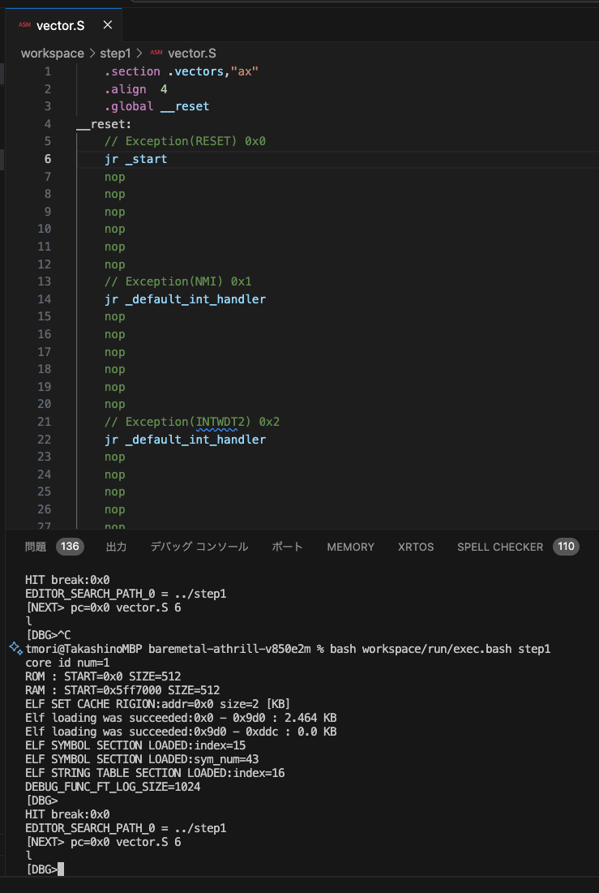

# baremetal-athrill-v850e2m

このリポジトリでは、アセンブラ言語(v850)で作成したプログラムをCPUエミュレータ[Athrill](https://www.toppers.jp/athrill.html)で動かすことができます。これにより、CPUレジスタの動きやメモリの関係、さらにはC言語プログラムのポインタ理解に役立てることができます。

## 動作環境
- macOS
- Ubuntu 22.04
- WSL2(Windowsの場合)

## 前提とする環境

- Visual Studio Code

## V850ハードウェアマニュアル

V850E2Mのハードウェアマニュアルは、以下のリンクからダウンロードできます。

https://www.renesas.com/ja/document/lbr/v850e2s-users-manual-architecture?srsltid=AfmBOoqYq2vh4w2W4SnqPHHl_LDucLJcuquwhjYxLkwnok4Da03Y6whD

## インストール方法

以下のコマンドを実行して、Athrillをビルドします。

```bash
bash build-athrill.bash
```

ビルドが成功すると、以下のようなメッセージが表示されます。

```
Usage:athrill -c<core num> -m <memory config file> [OPTION]... <load_file>
 -c                             : set core num. if -c is not set, core num = 2.
 -i                             : execute on the interaction mode. if -i is not set, execute on the background mode.
 -r                             : execute on the remote mode. this option is valid on the interaction mode.
 -t<timeout>                    : set program end time using <timeout> clocks. this option is valid on the background mode.
 -m<memory config file>         : set athrill memory configuration. rom, ram region is configured on your system.
 -d<device config file>         : set device parameter.
OK: athrill2 is created on /Users/tmori/project/oss/baremetal-athrill-v850e2m/athrill-target-v850e2m/cmake-build/athrill2
```

このメッセージが表示されれば、Athrillのビルドが成功しています。

## ベアメタルプログラム・ビルド環境のインストール

ベアメタルのプログラムをビルドするには、v850のクロスコンパイラが必要になります。このリポジトリには、Dockerを使用してクロスコンパイル環境をインストールする必要があります。

以下のコマンドを実行して、Dockerイメージを取得します。

```bash
bash docker/pull-image.bash
```

成功すると、Dockerイメージがダウンロードされます。取得したイメージは、以下のコマンドで確認できます。

```bash
docker images
```

コマンドの出力例は以下の通りです：

```
REPOSITORY                            TAG            IMAGE ID       CREATED         SIZE
toppersjp/athrill-v850e2m-builder     v1.0.0         ca4510b27935   5 hours ago     2.03GB
```

このイメージを使用して、ベアメタルプログラムのビルドを行うことができます。

## サンプルプログラムのビルド方法

サンプルプログラムのビルドは、サンプルプログラム名を指定して実行します。

例：サンプルプログラム名が`step1`の場合
```bash
bash docker/build.bash step1
```

成功すると、以下のログが出力されます。

```bash
bash docker/build.bash step1
arm64
Mac
ROOT_PATH=/root
ATHRILL_ROOT=/root/athrill-target-v850e2m
BUILD_PATH=/root/workspace/build
CPU_CONFIG_PATH=/root/athrill-target-v850e2m/src/cpu/config
v850-elf-gcc -c -I. -I/root/common -I/root/athrill-target-v850e2m/src/cpu/config -O0 -mdisable-callt -mno-app-regs -mtda=0 -gdwarf-2 -Wall -Wno-unused-label -Wpointer-arith  -mv850e2 -Wa,-mno-bcond17 -Wa,-mwarn-signed-overflow -Wa,-mwarn-unsigned-overflow start.S
v850-elf-gcc -c -I. -I/root/common -I/root/athrill-target-v850e2m/src/cpu/config -O0 -mdisable-callt -mno-app-regs -mtda=0 -gdwarf-2 -Wall -Wno-unused-label -Wpointer-arith  -mv850e2 -Wa,-mno-bcond17 -Wa,-mwarn-signed-overflow -Wa,-mwarn-unsigned-overflow vector.S
v850-elf-gcc -c -I. -I/root/common -I/root/athrill-target-v850e2m/src/cpu/config -O0 -mdisable-callt -mno-app-regs -mtda=0 -gdwarf-2 -Wall -Wno-unused-label -Wpointer-arith  -mv850e2 -Wa,-mno-bcond17 -Wa,-mwarn-signed-overflow -Wa,-mwarn-unsigned-overflow training.S
v850-elf-gcc -c -I. -I/root/common -I/root/athrill-target-v850e2m/src/cpu/config -O0 -mdisable-callt -mno-app-regs -mtda=0 -gdwarf-2 -Wall -Wno-unused-label -Wpointer-arith  -mv850e2 -Wa,-mno-bcond17 -Wa,-mwarn-signed-overflow -Wa,-mwarn-unsigned-overflow main.c
v850-elf-gcc -c -I. -I/root/common -I/root/athrill-target-v850e2m/src/cpu/config -O0 -mdisable-callt -mno-app-regs -mtda=0 -gdwarf-2 -Wall -Wno-unused-label -Wpointer-arith  -mv850e2 -Wa,-mno-bcond17 -Wa,-mwarn-signed-overflow -Wa,-mwarn-unsigned-overflow pointer.c
v850-elf-gcc -c -I. -I/root/common -I/root/athrill-target-v850e2m/src/cpu/config -O0 -mdisable-callt -mno-app-regs -mtda=0 -gdwarf-2 -Wall -Wno-unused-label -Wpointer-arith  -mv850e2 -Wa,-mno-bcond17 -Wa,-mwarn-signed-overflow -Wa,-mwarn-unsigned-overflow test_suite.c
v850-elf-gcc -c -I. -I/root/common -I/root/athrill-target-v850e2m/src/cpu/config -O0 -mdisable-callt -mno-app-regs -mtda=0 -gdwarf-2 -Wall -Wno-unused-label -Wpointer-arith  -mv850e2 -Wa,-mno-bcond17 -Wa,-mwarn-signed-overflow -Wa,-mwarn-unsigned-overflow test_instruction.S
v850-elf-gcc -O0 -mdisable-callt -mno-app-regs -mtda=0 -gdwarf-2 -Wall -Wno-unused-label -Wpointer-arith  -mv850e2 -Wa,-mno-bcond17 -Wa,-mwarn-signed-overflow -Wa,-mwarn-unsigned-overflow -nostdlib -T /root/workspace/build/v850esfk3.ld -o test_main.elf start.o vector.o training.o main.o pointer.o test_suite.o test_instruction.o -Wl,-Map,test_main.elf.map -lm -lgcc -lc
v850-elf-objdump -d test_main.elf > test_main.elf.dump
```

ビルドしたバイナリをクリーンするには、以下のコマンドを実行します。

```bash
bash docker/clean.bash step1
```

## サンプルプログラムの説明

このリポジトリには、ベアメタルプログラムの学習に役立つサンプルプログラムが含まれています。サンプルプログラムのファイルは `workspace/step1` ディレクトリにあります。

```bash
ls workspace/step1
```

```
Makefile                pointer.c               serial_api.h            test_check.h            test_instruction.S      test_serial.h           training.S              vector.S
main.c                  pointer.h               start.S                 test_data.h             test_reg.h              test_suite.c            v850asm.inc
```

### プログラムの流れ

サンプルプログラムでは、[main.c](./workspace/step1/main.c) が実行されるまでの一連の処理が含まれています。プログラムの実行は [vector.S](./workspace/step1/vector.S) およびスタートアップルーチン [start.S](./workspace/step1/start.S) から始まり、最終的に `main` 関数に制御が渡されます。これにより、ベアメタルプログラムの動作の本質を学ぶことができます。

#### スタートアップルーチン `start.S`

`start.S` は、プログラムの初期化を行うスタートアップルーチンです。ここでは、以下のようなコードが含まれています。

```assembly
.section	".text" , "ax"
.align	4
.globl	_start, _training
.type   _start, @function
_start:
	di
	Lea _stack_data, r3
	addi 1024, sp r3
	ei
	br	_training
.size	_start, .-_start
```

このルーチンでは、スタックの初期化と割り込みの無効化/有効化を行い、その後 [training.S](./workspace/step1/training.S)の`_training` ラベルへジャンプします。

#### トレーニングコード `_training`

`_training` ラベルには、アセンブラ言語でのジャンプ呼び出し練習として以下のコードが含まれています。

```assembly
#include "v850asm.inc"

.section	".text", "ax"
.align	4
.globl	_training
.type   _training, @function
_training:
    /*****************************
     * START
     *****************************/
    addi 1024, r9, r19

    /*****************************
     * END
     *****************************/
    Lea _main, r10
    jmp [r10]              // r10 の指すアドレスにジャンプ
.size		_training, .-_training
```

このコードでは、`r9` レジスタに `1024` を加算し、その結果を `r19` に格納します。その後、`main` 関数にジャンプします。

### `main.c` の説明

`main.c` には、`main` 関数が定義されています。

```c
#include "test_serial.h"
#include "serial_api.h"
#include "pointer.h"

unsigned char stack_data[1024];

extern void test_suite(void);

unsigned int test_data_uint32;

void test_print(const char *str)
{
	int i;
	for (i = 0; str[i] != '\0'; i++) {
		*(SERIAL_OUT_ADDR) = str[i];
	}
	//*(SERIAL_OUT_ADDR) = '\n';
}
void test_serial_hex(unsigned int data)
{
	int i;
	unsigned int mask = 0xF0000000;
	unsigned int shift = 28;
	unsigned int hex_data;
	*(SERIAL_OUT_ADDR) = '0';
	*(SERIAL_OUT_ADDR) = 'x';
	for (i = 0; i < 8; i++) {
		hex_data = (data & mask) >> shift;
		if (hex_data < 10) {
			*(SERIAL_OUT_ADDR) = '0' + hex_data;
		} else {
			*(SERIAL_OUT_ADDR) = 'A' + hex_data - 10;
		}
		mask = mask >> 4;
		shift -= 4;
	}
}

int main(void)
{
	pointer_init();
	pointer_write();
	pointer_read();

	test_print("\n");
	test_print("Hello World!\n");

	test_suite();
	while (1) {
		;
	}
}
```

この `main` 関数では、グローバル変数を利用したポインタアクセスが行われており、CPUがどのようにポインタを扱うかを学ぶことができます。また、標準出力はシリアルデバイスへのアクセスを通して行われています。最後に、テストスイートを呼び出して `addi` 命令のテストを実行します。

### テストスイート `test_suite`

[test_suite.c](./workspace/step1/test_suite.c)の`test_suite` では、以下のような `addi` 命令のテストが含まれています。

```assembly
#include "test_data.h"
#include "test_reg.h"
#include "v850asm.inc"

/*
 * ADD reg1, reg2
 */

.section	".text" , "ax"
.align	4

.global	_do_test_add1_1
.type   _do_test_add1_1, @function
_do_test_add1_1:
	addi	-20, sp, sp
	st.w	r20, 0[sp]
	st.w	r21, 4[sp]
	st.w	r22, 8[sp]
	st.w	r23, 12[sp]
	st.w	r24, 16[sp]
	/*
	 * prepare
	 */
	mov -1, r10
	 
	/* set input */
	mov 0x0,  r20
	mov 0x0,  r21
	/* set expect */
	mov 0x0, r22
	mov 0x1, r24
	ldsr r0, psw

	/*
	 * do test
	 */
	add r20, r21

	/*
	 * done
	 */
	 /* get test results*/
	 stsr psw, r23
	 cmp r21, r22
	 bne add1_0_test_fail
	 cmp r23, r24
	 bne add1_0_test_fail

	mov r0, r10

add1_0_test_fail:
	ld.w	0[sp], r20
	ld.w	4[sp], r21
	ld.w	8[sp], r22
	ld.w	12[sp], r23
	ld.w	16[sp], r24
	
	addi	20, sp, sp
	jmp		[lp]
.size	_do_test_add1_1, .-_do_test_add1_1
```

このコードでは、`addi` 命令の動作をテストし、期待された結果と比較する処理が行われています。

ベアメタルプログラムを理解するための格好の教材となっており、特にCPUレジスタやポインタアクセスの理解に役立つ内容となっています。

## Athrillでサンプルプログラムを動かそう！

Athrillでサンプルプログラムを動かすには、サンプルプログラム名を引数にして、`workspace/run/exec.bash` を実行するだけです。

```bash
bash workspace/run/exec.bash　<サンプルプログラム名>
```

実行方法：
```bash
% bash workspace/run/exec.bash step1
```

出力ログ：
```bash
core id num=1
ROM : START=0x0 SIZE=512
RAM : START=0x5ff7000 SIZE=512
ELF SET CACHE RIGION:addr=0x0 size=2 [KB]
Elf loading was succeeded:0x0 - 0x9d0 : 2.464 KB
Elf loading was succeeded:0x9d0 - 0xddc : 0.0 KB
ELF SYMBOL SECTION LOADED:index=15
ELF SYMBOL SECTION LOADED:sym_num=43
ELF STRING TABLE SECTION LOADED:index=16
DEBUG_FUNC_FT_LOG_SIZE=1024
[DBG>
HIT break:0x0
EDITOR_SEARCH_PATH_0 = ../step1
[NEXT> pc=0x0 vector.S 6
```

成功すると、このように、０番地でCPUが停止した状態になります。

また、`l` コマンドを実行すると、Visual Studio Codeのエディタが起動し、プログラムのソースコードが表示されます。

イメージ：




この状態でCPUレジスタ状態を確認してみましょう。cpuコマンドです。

```
cpu
***CPU<0>***
PC              0x0
R0              0x0
R1              0x0
R2              0x0
R3              0x0 Stack Pointer
R4              0x0
R5              0x0
R6              0x0 Arg1
R7              0x0 Arg2
R8              0x0 Arg3
R9              0x0 Arg4
R10             0x0 Return Value
R11             0x0
R12             0x0
R13             0x0
R14             0x0
R15             0x0
R16             0x0
R17             0x0
R18             0x0
R19             0x0
R20             0x0
R21             0x0
R22             0x0
R23             0x0
R24             0x0
R25             0x0
R26             0x0
R27             0x0
R28             0x0
R29             0x0
R30             0x0
R31             0x0
EIPC            0x0
EIPSW           0x0
ECR             0x0
PSW             0x20
SCCFG           0x0
SCBP            0x0
EIIC            0x0
FEIC            0x0
FEPC            0x0
FEPSW           0x0
CTBP            0x0
EIWR            0x0
FEWR            0x0
BSEL            0x0
VSECR = 0x00000000
VSTID = 0x00000000
VSADR = 0x00000000
VMECR = 0x00000000
VMTID = 0x00000000
VMADR = 0x00000000
MPM = 0x00000000
MPC = 0x00000000
TID = 0x00000000
```

ご覧の通り、PSW以外は全て０ですね。

次に、１命令実行してみましょう。`n`コマンドです。

```
[DBG>n
[DONE> core0 pc=0x0 null(null) 0x0: JR disp22(2000):0x7d0
```

このように、`JR` 命令が実行されていることがわかります。
cpuコマンドでプログラムカウンタを参照すると、このようにジャンプしたアドレスがセットされていることがわかりますね。
```
PC              0x7d0 start(+0x0)
```

このままステップ実行を続けると、命令実行に従って、CPUレジスタがどのように変化するかをみてみるとCPUの理解が深まると思います。
それでは、処理継続させて、main関数でブレークできるようにしましょう。`b`コマンドです。

```
[DBG>b main
break main 0x874
```

ブレーク設定されたメッセージが出力されました。このまま `c` コマンドでコンティニューします。

```
[DBG>c
[CPU>
HIT break:0x874 main(+0x0)
```

うまくブレークされました。`ft`コマンドを実行すると、処理の流れが見えます。

```
[DBG>ft 10
core0: <(null)                        (0xffffffea)> [  2] <0x000> start
core0: <test_data_uint32              (0x000)> [  1] <0x000> training
core0: <test_data_uint32              (0x000)> [  0] <0x000> main
```

`start｀ から始まり、`training` を経て、`main` 関数に入っていることがわかります。


このまま、プログラを実行しましょう。

```
c
[CPU>

Hello World!

PASSED : do_test_add1_1
```

プログラムを実行すると、シリアル出力に Hello World! が表示され、テストも通過したことが確認できます。

Athrillを使用したアセンブラ言語レベルでの高度なデバッグを体験できました。このリポジトリを使って、V850アセンブリ言語の理解を深め、ベアメタルプログラムのデバッグを学んでください。皆さんからのフィードバックをお待ちしています！


C言語ポインタをアセンブラ言語レベルで理解するための情報は、[こちら](./docs/README-pointer.md)を参照してください。